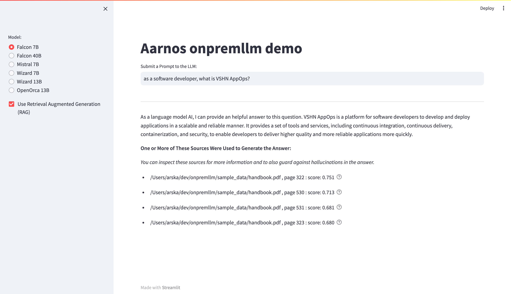

# Aarnos onprem.LLM demo

Using https://github.com/amaiya/onprem with a modified frontend to demo different models and RAG

## Installation

- On my Macbook pro M1 with Mac Os 14 (Sonoma), I used Python 3.11 (3.12 did not work), installed from MacPorts (https://www.macports.org/install.php)
- create a virtual environment to install in: python3 -m virtualenv venv; source venv/bin/activate
- Install llama-cpp-python with Apple Metal support: CMAKE_ARGS="-DLLAMA_METAL=on" FORCE_CMAKE=1 pip install llama-cpp-python
- Install the other dependencies: pip install -r requirements.txt

## Running

- load the python environment: source venv/bin/activate
- start the WebGUI: streamlit run app.py

## Data

- onprem stores all models and vectordb at "~/onprem_data/"
- we use the (supplied) PDF in ./sample_data/ for retrieval augmented generation (RAG)

## Screenshot

